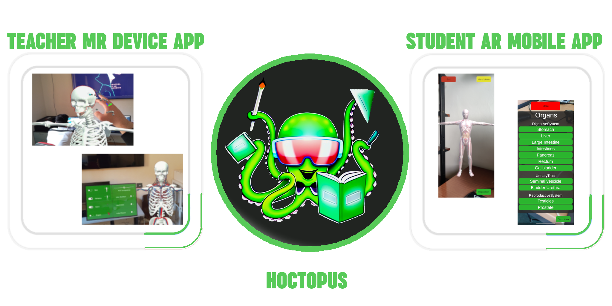

# [**HOCTOPUS: Empower Remote Class Teaching with Extended Reality**]()<br/>


[Lorenzo Stacchio](https://www.unibo.it/sitoweb/lorenzo.stacchio2)\*,
[Andrea Cirina](linkedin.com/in/andrea-cirina-87a435279)\*,
[Luca Asunis](https://www.linkedin.com/in/luca-asunis?miniProfileUrn=urn%3Ali%3Afs_miniProfile%3AACoAAC7swksBCCX_diC1XLaQWmcMON-KsQR9meU&lipi=urn%3Ali%3Apage%3Ad_flagship3_search_srp_all%3BoBHg60UxQfGCTxTSvzequg%3D%3D)\*,
[Gustavo Marfia](https://github.com/qp-qp)<br/>

| [GoodIT '23 Oral]([https://icec23.cs.unibo.it/](http://goodit.campusfc.unibo.it/)) | [paper](xxx) |

<p align="center">
  
</p>

``` 

HOCTOPUS provides an easy tool for both teachers and students to visualize, manipulate and share 3D objects in a live-stream fashion exploiting peer-to-peer network connections. In particular, HOCTOPUS consists of two main components thought for the two main actors of our use case: teachers and students. For teachers, we provided an MR streaming experience that let the user picks the 3D model for the class she/he wants to teach and straightforward interactions to manipulate during the explanation. For students instead, we developed an AR experience to visualize the streamed 3D object in a non-situated fashion, which real-time twins all the manipulations made by the teacher in the MR experience. Students have also the possibility to interact with the object and ask questions.

In particular, we developed the MR side of the system for the Hololens 2 and the AR one for Android mobile devices.
In practice, HOCTOPUS aims at supporting remote MR class teaching by streaming the teacher's manipulations of 3D models to all the students that joined the class, to enhance and improve the learning process of complex structures and processes.
``` 

## Requirements
* Unity 2019.4.xx

## Features 
### Hololens 2 - Teacher
<p align="center">
  
</p>

The hololens teacher application provide the following features: (a) loading 3D models for the objects the Teacher wants to use in its classes, (b) picking one object, (c) starting the remote class, (d) stream the manipulations made with the object, and (d) manage the connected students. The MR Teacher app exploits the Unity Relay Service (**UniRS**) by hosting the remote class session that the connecting clients will join (this aspect is used in features (c),(d), and (e)).

_Start/End a Remote class._ Once the Teacher user runs the MR application on the Hololens 2, a simple menu is spawned, including two virtual buttons that allow one to exit the application or start a new remote class. Once the User clicks the "New Class" button, the system spawns a new Menu containing all the classes the teachers defined. 
When the teacher picks the class s/he wants to teach, communication with the UniRS starts. The MR “Host” application sends a request to the Relay Allocation Service, which, based on the information received from the Host, spawns a Relay Server (**RS**) where the network session for the live remote class will be
hosted. Once the RS is allocated, the Host requests a join code. This special code will be used by the connecting clients to join the same remote class.
The Host MR application is also responsible for managing and updating the information about the 3D object state of the class to all the connected clients. To carry out this task, the MR system spawns a Netcode for GameObject (**NGO**) process that synchronizes the state of the class objects by broadcasting it to all the connected clients, exploiting the UniRS. Once the NGO process was spawned, the user is asked to watch the floor to place the spawned network 3D object in a comfortable position. At any moment, the MR host could close the remote class session by sending a disconnection signal to the UniRS. This action will disconnect all the connected clients from the session and will shut down the Allocated RS.

_In-Class activities: 3D object Manipulation and Connected Students Management_. Once the teacher started the class, s/he has the chance to manipulate the spawned 3D Object and manage the connected students. To ease the interaction for those different features, we design a Hand-Menu. In practice, we exploit the Hand-Tracking system provided by the MRTK to spawn in the user’s **right hand**, a **general menu**, that is used to enable the aforementioned
features. This menu provides the chance to: (a) visualize the connected student list,(b) manipulate the 3D model, (c) reset its position, and finally, (d) substitute it with another one.
When the user interacts with the "Students list" button, a novel menu appears, showing the list of the connected clients. Per each client, the teacher can give the student permission to remotely manipulate the 3D model for the question, accept a student’s question, or remove s/he from the remote class session. When one of the students raises their hands to ask a question, the system will pop-up a notification with a virtual element in the teacher’s view. 
The “Manipulate” button enables all the 3D object manipulation features. In particular, the teacher could move and rotate the object, show and hide the object components and correlated labels, and outline any visible components.
The “Reset position” button allows to reset the model position to its original state. Finally, the “Change Model” let the teacher user change the utilized object.


### Android - Student

<p align="center">
  
</p>


## Deployment Hololens 2
1. Go to `File -> Build Settings`. Here change the **platform** by selecting `Universal Windows Platform` and pressing on `Switch platform`. Once you have changed the platform, make sure you have these settings:
<p align="center">
  
</p>

2.  Next go to `Player Settings`, make sure you are on the correct platform and scroll down until you find `Publishing Settings`. Here you need to **create a new certificate** and **select it** for this project. At the end of the operation you will have a screen similar to this one:
<p align="center">
  
</p>

3.  Now go to `Mixed Reality -> Toolkit -> Utilities -> Build Window`. 
<p align="center">
  
</p>

4. In the window that will open, make sure you have the following settings:
<p align="center">
  
</p>

⚠️**Warning**⚠️. Make sure the folder you are doing the build in is **empty**!
Then click on `Build Unity Project`.

5. Once the build is finished, go to the folder that was created automatically (`Builds --> WSAPlayer`) and open the `.sln` file with visual studio. In the window on the right called `Solution Explorer`,  open the file `Package.appxmanifest` directly from **visual studio**. Click on `Create Package`, and you will see a screen similar to this one:
<p align="center">
  
</p>

Here click on `Choose certificate...` and select the one you created **earlier**.

6. Now go back to `Solution Explorer` and right-click on `Package.appxmanifest`, then `Open with... -> XML Editor`.  Here you need to make sure that `PhoneProductId` and `PhonePublisherId` have the **same code**. Also go all the way down and make sure the `Capabilities` are configured like this:    
 <p align="center">
  
</p>


🔴**Important**❗🔴 **Close** Visual Studio, a warning will appear and you will need to **save**. ⚠️ **Do not skip this step.** ⚠️

7. Now **go back to Unity** and in the `Build Window` section click on `Appx Build Options`. Put in the following settings:
<p align="center">
  
</p>

Finally click on `Build Appx`.

8. Now you'll just go to `<<NameOfTheProject>>\Builds\WSAPlayer\AppPackages\<<NameOfTheProject>>_1.0.1.0_ARM64_Test`.
Here you will find the package (`.appx`) to install on the Hololens 2. We recommend that you use the **device portal** for installation.
<p align="center">
  
</p>

## Deployment Android
As a reminder, at least **version 8.0 Oreo is required** for deployment on **Android**.
The settings for deploying on Android are the **same** as for **any augmented reality application**.
1. **Change the platform** to the Android platform;
2. Go to `Player Settings`;
3. In the `Other settings` section make sure you have the **following settings**:
<p align="center">
  
</p>

<p align="center">
  
</p>

<p align="center">
  
</p>

⚠️**Before** building, **connect** your smartphone to your pc and make sure it has **usb debugging enabled**. At this point **you can build and deploy** to your smartphone.⚠️

## Demo

The demo is in the ...


## References 
* **Floor Finder** - https://github.com/LocalJoost/FloorFinder.git
* **Outline** - https://github.com/chrisnolet/QuickOutline.git


